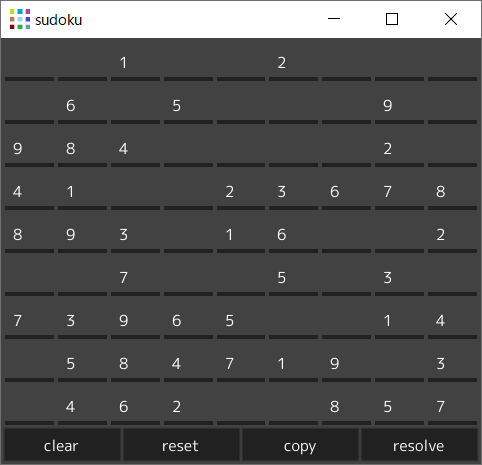

# sudokusolver

9x9 マスの数独を解くプログラム

## 上部のマス目部分

conf.json に記録されている各初期値が表示される。
各マス目上でキー入力することで値を変更することができる。

* マス目上で '0'キー, スペースキー, バックスペースキーを入力するとマス目の値が空になる。
* '1'～'9' キーを入力するとマス目の値が入力されたキーの値になる。
* それ以外のキーは無視される。

## 下部のボタン部分

|ボタン|動作|
|:---:|:---|
|clear|すべてのマス目を空にする|
|reset|初期値にリセットする|
|copy|マス目の値をクリップボードにコピーする|
|resolve|空のマス目を解決する|
